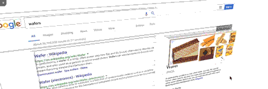
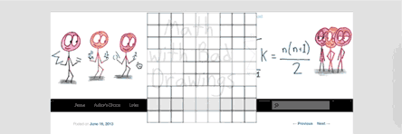
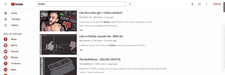
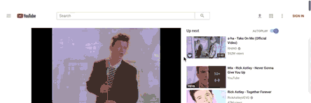
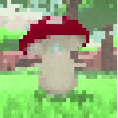

# Bookmarklets

A collection of JavaScript bookmarklets I wrote.

Contents

- [Usage](#usage)
- [Novelties](#novelties)
  - [Tri.js](#trijs)
  - [Piano.js](#pianojs)
  - [Mouselight.js](#mouselightjs)
  - [Tic.js](#ticjs)
  - [Lupire.js](#lupirejs)
- [YouTube Tools](#youtube-tools)
  - [YTEngagement.js](#ytengagementjs)
  - [YTScroller.js](#ytscrollerjs)
  - [YTLiveStamper.js](#ytlivestamperjs)
  - [YTSpeed.js](#ytspeedjs)
  - [YTThumb.js](#ytthumbjs)
  - [YTGlow.js](#ytglowjs)
- [Toggles](#toggles)
  - [Pop.js](#popjs)
  - [Edit.js](#editjs)
  - [Invert.js](#invertjs)
  - [InvertMedia.js](#invertmediajs)
  - [Censor.js](#censorjs)
- [Selections](#selections)
  - [InvertSelection.js](#invertselectionjs)
  - [DeleteSelection.js](#deleteselectionjs)

# Usage

Copy and paste the **minified** script (linked in the titles) into your bookmarks and open the bookmark to activate it.

Note:

- The **full** script may not work in bookmarklet format due to comments (`//`) or certain unencoded characters (`%`). Use the **minified** script.
- Likewise, the **minified** script may not work if pasted into the developer console or used within a userscript. This is because I replaced all `%`s with `%25` in the minified scripts to make them bookmarklet-compatible. Use the **full** script for userscript purposes.
- Bookmarklets must have `javascript:` at the beginning to work.  Some browsers automatically delete this label when pasting, so make sure it's there.
- Instead of the minified script, you can alternatively use the following script (replacing `[SCRIPT_NAME]` with `tri` or `piano` or `lupire` etc.)
  - `javascript:void(document.head.appendChild(document.createElement("script")).src="https://cdn.jsdelivr.net/gh/Krazete/bookmarklets/[SCRIPT_NAME].js")`
  - This type of bookmarklet retrieves the script from this repository every time. This has pros and cons.
    - It is always up-to-date.
    - It may take longer to load depending on your internet and the servers of GitHub and jsDelivr.
    - It may not work on some websites due to CORS, CORB, TrustedTypePolicy, or other security measures.

# Novelties

These bookmarklets are toys or games. I spent the most time crafting these.

## [Tri.js](min/tri.min.js)

View a webpage in 3D layers. Includes a settings menu in the top left corner to control various dimensional aspects.

## [Piano.js](min/piano.min.js)

Add a piano to any webpage.

If you want shorter code for some reason, replace the big `disc:[[],[{ ... timeout:null}]]` block with `disc:[[]]`. This deletes the sample tracks.

Left Menu:

- Wave: waveform type
- Pitch: octave level
  - can also use left and right keyboard arrows
- Tilt: piano angle
  - can also use up and down keyboard arrows

Right Menu:

- `↻ ▶`/`↻ ◼`: play/stop recording
  - recording starts automatically from the first note you play
- `⬇`: save recording as a track
- `✖`: toggle deletion mode
  - after entering deletion mode, click `↻ ✖` or `n ✖` to reset recording or delete track #n
  - can also reset recording with spacebar
- `n ▶`/`n ◼`: play/stop track #n
- `⬆︎`: export all tracks
  - search console output for the track (disc) you want to save and paste it at the end of `piano.disc` list in the script
  - only useful with a local copy of the source code (e.g. me and pull requesters)

## [Mouselight.js](min/mouselight.min.js)

Simulate a flashlight. Works best on websites with deeply nested HTML elements.

## [Tic.js](min/tic.min.js)

A game of ultimate tic-tac-toe. The rules are explained [here](https://mathwithbaddrawings.com/2013/06/16/ultimate-tic-tac-toe/).

[TicMobile.js](min/ticmobile.min.js) is optimized for mobile devices.

## [Lupire.js](min/lupire.min.js)

A replicated memory game. See **Lu**mosity's [**pi**nball **re**call](https://lumosity.com/brain-games/pinball-recall).

[LupireMobile.js](min/lupiremobile.min.js) is optimized for mobile devices.

# YouTube Tools

These bookmarklets are specifically for YouTube. They're written for desktop, but they should work on the mobile website too.

Many of these are more useful with a userscript manager like TamperMonkey. Use the full script in these cases.

## [YTEngagement.js](min/ytengagement.min.js)

Preview the likes-to-views ratio of YouTube videos. For easier visibility, the ratio bar is displayed as `log(likes + 1) / log(views + 1)`. [[full script](ytengagement.js)]

## [YTScroller.js](min/ytscroller.min.js)

Keep the video in view while scrolling down the comment section. [[full script](ytscroller.js)]

## [YTLiveStamper.js](min/ytlivestamper.min.js)

Record timestamps for a video even during a livestream. [[full script](ytlivestamper.js)]

Panel Parts:

- Stamplist
  - the minus and plus buttons increment the timestamp accordingly
  - timestamps are clickable and have copyable urls
  - text input is for notes and comments
- "End of Video" Timestamp
  - always at the bottom of the stamplist
  - it's there so you can return to real time after checking a past timestamp
  - usually useless since most live streams don't allow backtracking in the first place
- "Import List" Button
  - overwrites current stamplist with textbox contents
  - useful if you need to refresh the page or delete individual timestamps
- "Add Timestamp" Button
  - adds current time (minus 5 seconds) to stamplist
- "Copy List" Button
  - writes stamplist to textbox and copies textbox to clipboard
  - double-click to copy stamplist as list of urls instead (cannot be imported)

Note that YouTube will hide a comment if it has an unusually large amount of timestamps relative to normal text.

Having a note for every timestamp will help ensure your comment remains visible to others.

## [YTSpeed.js](min/ytspeed.min.js)

Speed up the video even more. Also has a slider to dim the video because why not? [[full script](ytspeed.js)]

Note: At x10 speed, the video usually plays faster than it can load.

This bookmarklet works for videos on other websites too.

## [YTThumb.js](min/ytthumb.min.js)

Get the maximum resolution thumbnail of the current video.

## [YTGlow.js](min/ytglow.min.js)

An alternative to YouTube's ambient mode. [[full script](ytglow.js)]

| Ambient Mode | YTGlow.js |
|---|---|
| Works by slowly radiating the video's colors outward. | Works by adding a simple blur effect behind the video. |
| If the video suddenly turns dark, the glow will linger for a while. |  If the video suddenly turns dark, the glow will disappear instantly. |
| Not available for live or unprocessed videos. | Works on all videos. |

It also kinda works with the light theme if you remove the `canvas.style.mixBlendMode = "lighten"` line. Darkness isn't supposed to glow though, so it'll looks strange.

It's a little buggy, especially if using the miniplayer. This bookmarklet is togglable, so you can turn it off easily if it suddenly blurs the entire screen or something.

# Toggles

These bookmarklets are simple tools and have no UI. Click the bookmarklet to turn it on or off.

## [Pop.js](min/pop.min.js)

Toggle picture-in-picture mode for the first video on the page.

## [Edit.js](min/edit.min.js)

Make the entire webpage editable.

## [Invert.js](min/invert.min.js)

Invert the webpage. Useful with InvertMedia.js to create a dark mode for bright websites.

## [InvertMedia.js](min/invertmedia.min.js)

Invert image and video elements.

## [Censor.js](min/censor.min.js)

Pixelates all visible img and video elements. Uncensors on hover.

Very buggy. Issues include:

- most lazy-loaded images won't load at all
- may not update to style changes of img or video
- doesn't work for iframes
- GIFs only show the first frame
- layout shifts
- will shrink or stretch if img or video doesn't fill its space
- hovering doesn't always uncensor

Toggle twice to reset the censors (this fixes the first two issues only).

# Selections

More tools. Select an area of the page to choose which elements to affect.

## [InvertSelection.js](min/invertselection.min.js)

Inverts selected elements. This works by sampling 100 points within your selection and inverting the topmost common element.

## [DeleteSelection.js](min/deleteselection.min.js)

Deletes selected elements. Useful for some ads and paywalls.
